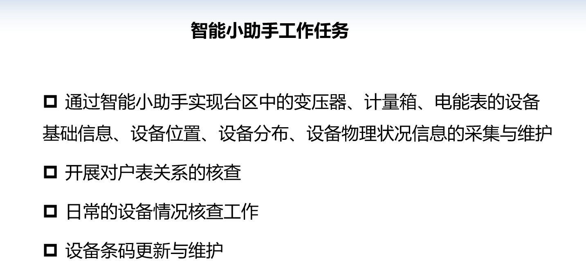
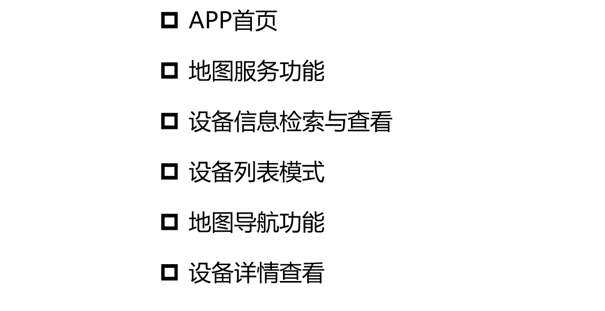
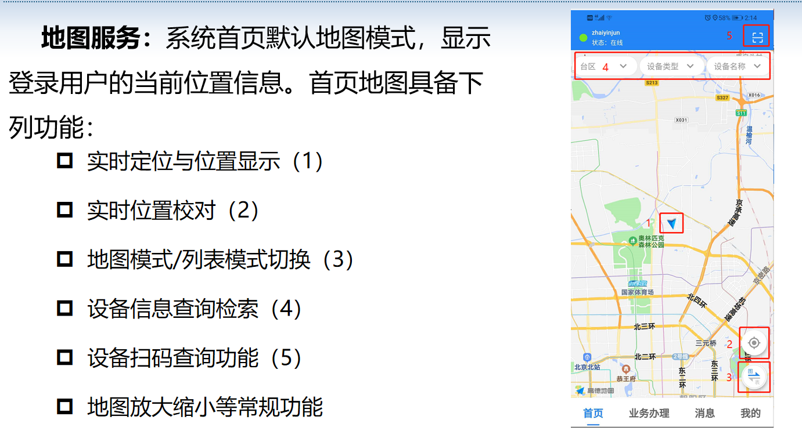
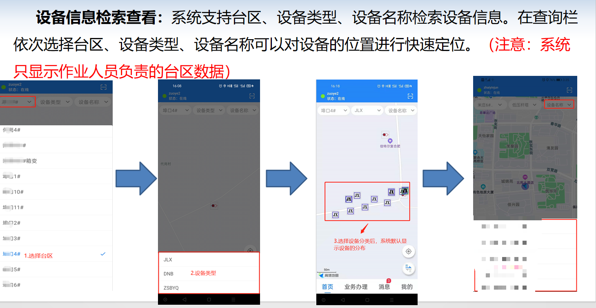
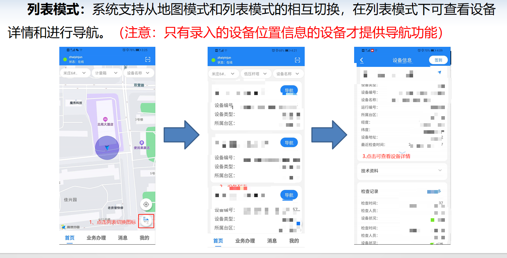
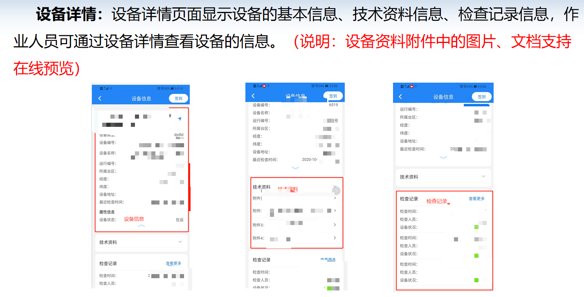
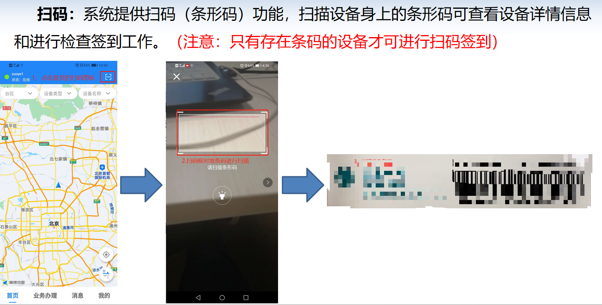
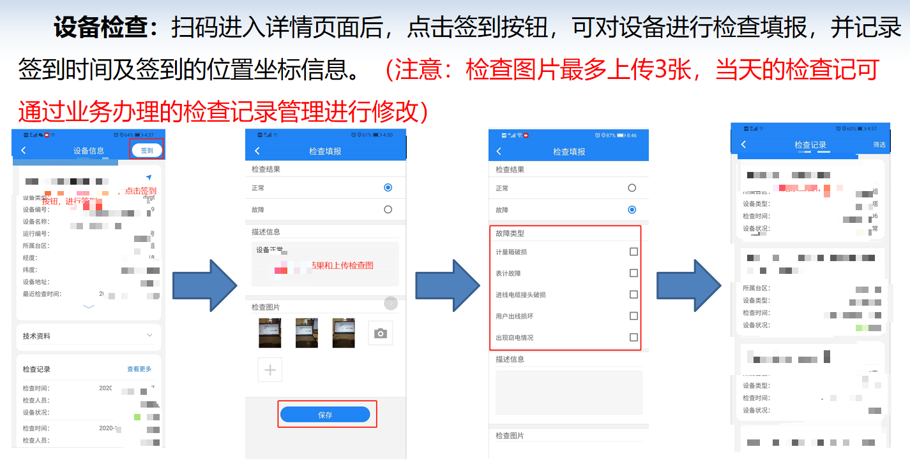
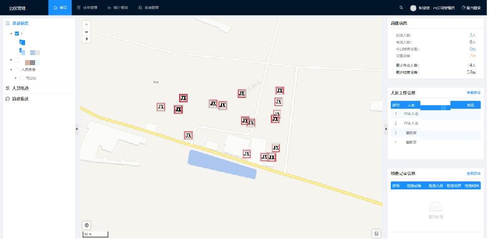

# 智慧电力-台区巡查-营配核查

#### 介绍
台区网架智能管理助手（简称：智能小助手）分App端和Web端两部分建设，主要实现以下功能：

台区及台区设备信息统一管理
、台区作业人员统一管理
、台区设备及作业人员作业定位
、作业人员作业轨迹查询
、地理信息服务
、消息服务
、设备基础信息采集和定位
、营配核查
、设备检查
、设备定位导航
、……..

承接软件定制开发

价格优惠

WeChat:2609375767

#### 软件架构
软件架构说明

后端技术：Spring Boot 2.6.6 +MybatisPlus 3.5.1 + Shiro 1.8.0+ Jwt 3.11.0 + Swagger + Redis

前端技术： Ant-design-vue + Vue

GIS框架：mapboxgl + leaflet + Cesium

其他技术： Druid（数据库连接池）、Logback（日志工具） 、poi（Excel工具）、 Quartz（定时任务）、lombok（简化代码）

项目构建： Maven、Jdk8

#### 软件介绍

1.智能小助手工作任务
 
2.基本服务功能介绍：

3.系统首页

 4. 设备信息检索查看
 
 5. 列表模式
 
 6. 设备详情
 
 7.设备扫码
 
 8.设备检查
 
9. web端首页

#### 特技

1.  使用 Readme\_XXX.md 来支持不同的语言，例如 Readme\_en.md, Readme\_zh.md
2.  Gitee 官方博客 [blog.gitee.com](https://blog.gitee.com)
3.  你可以 [https://gitee.com/explore](https://gitee.com/explore) 这个地址来了解 Gitee 上的优秀开源项目
4.  [GVP](https://gitee.com/gvp) 全称是 Gitee 最有价值开源项目，是综合评定出的优秀开源项目
5.  Gitee 官方提供的使用手册 [https://gitee.com/help](https://gitee.com/help)
6.  Gitee 封面人物是一档用来展示 Gitee 会员风采的栏目 [https://gitee.com/gitee-stars/](https://gitee.com/gitee-stars/)
